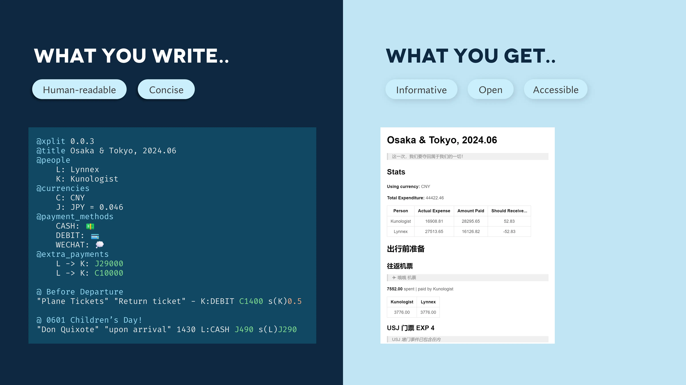

# XplitPay

XplitPay is a Python package to parse and calculate multi-person trip expenses.

Ever want to split the bill with friends during a trip? How can we make it easier for everyone to pay their share? XplitPay is here to help!



## What you need to do

Currently, `XplitPay` is only available as a PyPI package. You can install it by running:

```bash
pip install xplitpay
```

Here is the sample usage to get started:

```python
file_path = 'tests/2_ppl.xplit'
xplit_log = parse_xplit(file_path, ALWAYS_INVOLVE_EVERYONE=True, SUPPORT_48_HOURS=True)

# Calculating total expenses
total_expenses = sum(entry.expense for entry in xplit_log.entries)
print(f"Total expenses: {total_expenses}")

# Calculating total splits
total_splits = {person: 0 for person in xplit_log.people.values()}
for entry in xplit_log.entries:
    for person, amount in entry.splits.items():
        total_splits[person] += amount
print(f"Total splits: {total_splits}")

# Total paid by each person
total_paid = {person: 0 for person in xplit_log.people.values()}
for entry in xplit_log.entries:
    total_paid[entry.paid_by] += entry.expense
print(f"Total paid: {total_paid}")
```

**Features that are still in development are marked with strikethrough.**

Pick your way of using XplitPay:

1. ~~Visit the webapp at [http://kunologist.pythonanywhere.com/xplitpay](http://kunologist.pythonanywhere.com/xplitpay) and edit the entries online.~~
2. ~~Use any text editor to create a human-readable xplit file and upload it to see the results.~~
3. ~~Use the command line interface to parse the xplit file locally.~~

~~For developers, additionally, you may use our web API to integrate XplitPay functionalities into your own app.~~
